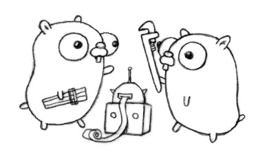

# GOPHERSIESTA

A manager/service for configurations files and properties



## Installation

```
go get github.com/gin-gonic/gin
```

## Run

```
cd server

go run server.go
```

## API

### Get template for :appname
```
http://gophersiesta.herokuapp.com/conf/:appname
```
Retrieve the full template file for the application.


### Retrieve list of placeholders
```
http://gophersiesta.herokuapp.com/conf/:appname/placeholders
```
Get the list of all possible variables of the template.


### Retrieve current values of placeholders for :appname  
```
http://gophersiesta.herokuapp.com/conf/:appname/values?labels=:label1,:label2
```
Get the values that are going to be used to generate the template. Labels override previous values. 


## TODO

+ Post value for placeholders given some labels
+ Render the templace conf applying the saved values given some labels


The Gopher character is based on the Go mascot designed by Renée French and copyrighted under the Creative Commons Attribution 3.0 license.