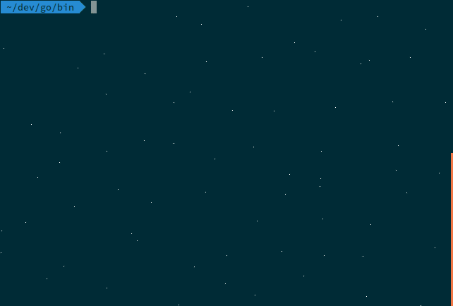
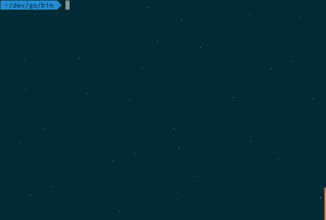

# GOPHERSIESTA

.      .__                 __
  _____|__| ____   _______/  |______
 /  ___/  |/ __ \ /  ___/\   __\__  \
 \___ \|  \  ___/ \___ \  |  |  / __ \_
/____  >__|\___  >____  > |__| (____  /
     \/        \/     \/            \/

A manager/service for configurations files, properties placeholders and their values separated by application and namespaces.
GopherSiesta is composed of two parts, a server and an example command line client to communicate with the server's API.

The goal of GopherSiesta is to make it easier to manage the configurations of all your services following the [12 factor app](http://12factor.net/config) best practices. GopherSiesta client will run prior to your application and fetch the corresponding configuration for your service.

Currently the values for the placeholders for a given set of labels can be stored in:

+ Persisted [bolt DB](https://github.com/boltdb/bolt)
+ Volatile map


## Installation

As the project uses [godep](https://github.com/tools/godep) to make builds reproducibly

```
    go get github.com/gophergala2016/gophersiesta
```

## Run

```
cd cmd/gophersiesta-server

go run main.go
```

## API

### Get template for :appname
```
http://gophersiesta.herokuapp.com/conf/:appname
```
Retrieve the full template file for the application.

*Example*
```yaml
GET http://gophersiesta.herokuapp.com/conf/app1

application:
    name: "App1"
    version: 0.0.1

datasource:
    url: ${DATASOURCE_URL:jdbc:mysql://localhost:3306/shcema?profileSQL=true} # has default value
    username: ${DATASOURCE_USERNAME} # has no default value. If no value is passed should producer error if validated
    password: ${DATASOURCE_PASSWORD}
```


### Retrieve list of placeholders
Get the list of all possible variables of the template.

```
http://gophersiesta.herokuapp.com/conf/:appname/placeholders
```

*Example*

```json
GET http://gophersiesta.herokuapp.com/conf/app1/placeholders
{
  "placeholders": [
    {
      "placeholder": "DATASOURCE_URL",
      "property_value": "${DATASOURCE_URL:jdbc:mysql://localhost:3306/shcema?profileSQL=true}",
      "property_name": "datasource.url"
    },
    {
      "placeholder": "DATASOURCE_USERNAME",
      "property_value": "${DATASOURCE_USERNAME}",
      "property_name": "datasource.username"
    },
    {
      "placeholder": "DATASOURCE_PASSWORD",
      "property_value": "${DATASOURCE_PASSWORD}",
      "property_name": "datasource.password"
    }
  ]
}
```

### Retrieve current values of placeholders for :appname  
Get the values that are going to be used to generate the template. Labels override previous values. 

```
http://gophersiesta.herokuapp.com/conf/:appname/values?labels=:label1,:label2
```


*Example*
```json
GET http://gophersiesta.herokuapp.com/conf/app1/values
{
    "values": [
        {
            "name": "DATASOURCE_PASSWORD",
            "value": "FOOBAR"
        },
        {
            "name": "DATASOURCE_USERNAME",
            "value": "GOPHER"
        }
    ]
}

GET http://gophersiesta.herokuapp.com/conf/app1/values?labels=dev
{
    "values": [
        {
            "name": "DATASOURCE_PASSWORD",
            "value": "LOREM"
        },
        {
            "name": "DATASOURCE_USERNAME",
            "value": "GOPHER-dev"
        }
    ]
}

GET http://gophersiesta.herokuapp.com/conf/app1/values?labels=prod
{
    "values": [
        {
            "name": "DATASOURCE_PASSWORD",
            "value": "IPSUM"
        },
        {
            "name": "DATASOURCE_URL",
            "value": "jdbc:mysql://proddatabaseserver:3306/shcema?profileSQL=true"
        },
        {
            "name": "DATASOURCE_USERNAME",
            "value": "GOPHER-prod"
        }
    ]
}

GET http://gophersiesta.herokuapp.com/conf/app1/values?labels=dev,prod
{
    "values": [
        {
            "name": "DATASOURCE_PASSWORD",
            "value": "IPSUM"
        },
        {
            "name": "DATASOURCE_USERNAME",
            "value": "GOPHER-prod"
        },
        {
            "name": "DATASOURCE_URL",
            "value": "jdbc:mysql://proddatabaseserver:3306/shcema?profileSQL=true"
        }
    ]
}

GET http://gophersiesta.herokuapp.com/conf/app1/values?labels=prod,dev
{
    "values": [
        {
            "name": "DATASOURCE_URL",
            "value": "jdbc:mysql://proddatabaseserver:3306/shcema?profileSQL=true"
        },
        {
            "name": "DATASOURCE_USERNAME",
            "value": "GOPHER-dev"
        },
        {
            "name": "DATASOURCE_PASSWORD",
            "value": "LOREM"
        }
    ]
}
```

### Retrieve list of labels
Get the list of all possible variables of the template.
```
http://gophersiesta.herokuapp.com/conf/:appname/labels
```

*Example*

```json
GET http://gophersiesta.herokuapp.com/conf/app1/labels
{
  "labels": [
    "default",
    "dev",
    "prod"
  ]
}
```


### Render config file
Render replaces the placeholders with the previously stored values. Depending on the provided labels different files, will be rendered
```
http://gophersiesta.herokuapp.com/conf/:appname/render/yml
```

*Example*

```yaml
http://gophersiesta.herokuapp.com/conf/app1/render/yml
application:
  name: App1
  version: 0.0.1
datasource:
  password: FOOBAR
  url: jdbc:mysql://localhost:3306/shcema?profileSQL=true
  username: GOPHER
```

```yaml
GET http://gophersiesta.herokuapp.com/conf/app1/render/yml?labels=dev 
application:
  name: App1
  version: 0.0.1
datasource:
  password: dev_password
  url: dev_url
  username: dev_user
```

```yaml
GET http://gophersiesta.herokuapp.com/conf/app1/render/yml?labels=prod 
application:
  name: App1
  version: 0.0.1
datasource:
  password: IPSUM
  url: jdbc:mysql://proddatabaseserver:3306/shcema?profileSQL=true
  username: GOPHER-prod
```


## Command line client

All the API operations are available through a command line APP, because we gophers love the command line.

The best way to explain the functionality is seeing it action:

### Retrieve placeholder values



In this gif you can see:

+ How to retrieve placeholder values.
+ How to retrieve placeholder values by label.
+ How the labels order *matter*.

### Render the final config file



In this gif you can see:

+ How to render the file given a label

### Setting placeholder values all at once


In this gif you can see:

+ How all the values for placeholders for a label are set

## TODO

+ Herachical config files app merger for a given app and labels
+ Render the template conf applying the saved values given some labels, into *toml*, *json*, *xml*. Currently there is some strange behaviour of *viper* that return strange key type.
+ Web interface.
+ Incorporate the command line client into a docker container to load the placeholder values as ENV variable to enforce [12 factor app](http://12factor.net/config) best practices.
+ Store in consul or etc.
+ Read conf files from github.
+ Wizard to add a new variable for a given app, for currently specified labels.
+ Check if all placeholders are set for a given app, for currently specified labels.
+ If a property have a placeholder with a default value, an no value is stored, the default value is returned

The Gopher character is based on the Go mascot designed by Renée French and copyrighted under the Creative Commons Attribution 3.0 license.
